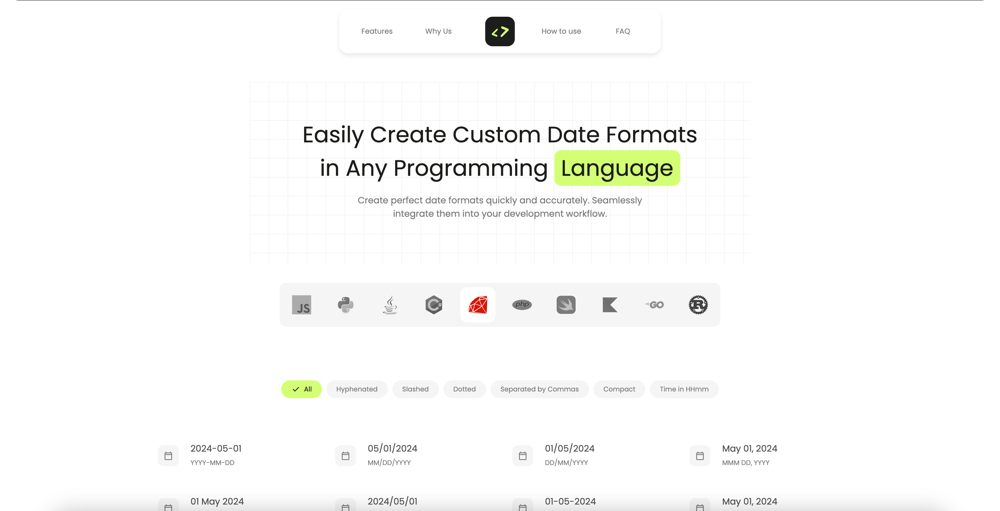

<div>
  <a href="https://github.com/othneildrew/Best-README-Template">
    
  </a>

  <h1>Codate</h1>

  <p>
    Welcome to Codate 👋! Codate is a developer-friendly tool that simplifies date formatting across multiple programming languages. Whether you're working with JavaScript, Python, Java, C#, Ruby, PHP, Swift, Kotlin, Go, or Rust, 
    Codate helps you generate the perfect date format code snippet effortlessly.
    <br />
    <br />
    <a href="https://codate.io" target="_blank"><strong>Try it Now »</strong></a>
  </p>
</div>

<br />




## Features

- <b>Multi-language Support:</b> Generate date format code snippets for `JavaScript`, `Python`, `Java`, `C#`, `Ruby`, `PHP`, `Swift`, `Kotlin`, `Go`, and `Rust`.
- <b>Various Date Formats:</b> Choose from a wide range of date formats including `YYYY-MM-DD`, `MM/DD/YYYY`, `DD/MM/YYYY`, and more.
- <b>Easy to Use:</b> Select your preferred programming language and date format, then copy the generated `code snippet`.
- <b>Developer-Friendly:</b> Save `time` and avoid `errors` with our intuitive interface designed specifically for developers.

<br />

## How to Use

1. <b>Select Language:</b> Choose your preferred programming `language`.
2. <b>Select Date Format:</b> Pick a `date format` that suits your project's needs.
3. <b>Copy Code Snippet:</b> Copy the generated `code` snippet and paste it into your project.

<br />

## Example
1. <b>Select Language:</b> `JavaScript`
2. <b>Select Date Format:</b> `YYYY-MM-DD`
3. <b>Copy Code Snippet:</b>

```javascript

function formatDate(date) {
  const d = new Date(date);
  const year = d.getFullYear();
  const month = String(d.getMonth() + 1).padStart(2, '0');
  const day = String(d.getDate()).padStart(2, '0');
  return `${year}-${month}-${day}`;
}

console.log(formatDate(new Date())); 

// Outputs: 2024-05-01

```

<br />

## Beta Notice
⚠️ Notice: **Codate** is currently in beta. Mobile responsiveness is under development. For now, please use the platform on a desktop or tablet.

<br />

## Get Involved
Got feedback or ideas? We'd love to hear from you! Open an issue or pull request on GitHub.

<br />

## License
MIT License. See the [LICENSE](https://github.com/BadreddineIbril/Codate/blob/main/LICENSE) file for more details.
